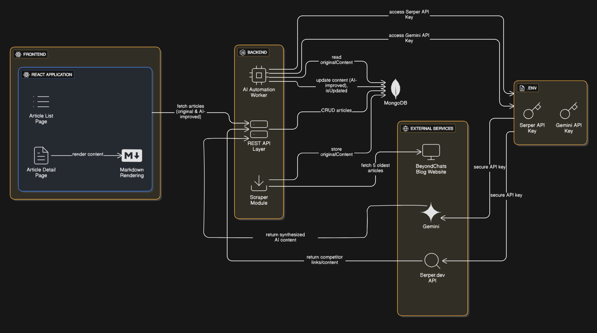

# AI-Content-Automator

A Full-Stack MERN Project for Intelligent Content Research and Transformation.

## Project Overview

This project is an automated content pipeline that scrapes the oldest available articles, performs competitive research via real-time Google Search, and utilizes Large Language Models (LLMs) to enhance and modernize content.

### The 3-Phase Journey

**Phase 1 (Data Foundation):** Scrapes the 5 oldest articles from the BeyondChats blog and stores them in MongoDB with full CRUD API support.

**Phase 2 (AI Intelligence):** A Node.js worker script searches Google for top-ranking competitors (Serper API), scrapes their content, and uses Gemini 2.5 Flash to rewrite the original articles into a professional, high-ranking format.

**Phase 3 (Professional UI):** A responsive React dashboard that allows users to toggle between "Original" and "AI-Improved" versions of every article.

### Architecture & Data Flow

1. **Server Init:** On startup, the backend checks if the MongoDB database is empty.

2. **Auto-Seed:** If empty, it triggers the Phase 1 scraper to fetch historical data.

3. **Research & Rewrite:** The automation script (Phase 2) queries the Serper API for competitor links and calls Gemini for content synthesis.

4. **Publish:** The improved content is updated in the database via the Article CRUD APIs.

5. **Render:** The React frontend fetches articles and renders Markdown content for a clean reading experience.

## Architecture & Data Flow Diagram



### Local Setup Instructions

**Prerequisites**

- Node.js (v16+)
- MongoDB (Local or Atlas)
- API Keys: Google Gemini API and Serper.dev API

1. **Backend Setup(PHASE-1)**

   - Create a .env file in the backend folder:
     ```
     PORT=5000
     MONGO_URI=your_mongodb_connection_string
     GEMINI_API_KEY=your_gemini_key
     SERPER_API_KEY=your_serper_key
     ```
   - Start the Server:

     ```
     cd backend
     npm install
     npm start
     ```

     **_Note:_** The first time you run this, the scraper will automatically populate the 5 oldest articles into your database.

2. **AI Automation (PHASE-2)**

   - To trigger the AI research and rewriting process:
     ```
     # While the server is running, in a new terminal:
     cd backend
     npm run improve
     ```

3. **Frontend Setup (PHASE-3)**
   ```
       cd frontend
       npm install
       npm run dev
   ```
   The app will be available at http://localhost:5173

### Features & Technical Highlights

1. **Zero-Config Startup:** Automated database seeding on server initialization.

2. **Smart Filtering:** AI script filters out non-article domains (YouTube, Amazon, etc.) to ensure high-quality research sources.

3. **Markdown Support:** Full rendering of AI-generated headings, lists, and bold text using react-markdown.

4. **Responsive Design:** A professional grid layout that adapts seamlessly from desktop to mobile screens.

5. **Toggle View:** Real-time switching between original scraped data and AI-enhanced content.

### Live Links

**Frontend (Live):** [\[Your Vercel/Netlify Link\]](https://ai-content-automator.vercel.app)

- Open the frontend link to view and toggle between Original and AI-Improved articles.

**Backend (API):** [\[Your Render/Railway Link\]](https://ai-content-automator.onrender.com)
Sample API Endpoints:

1. Fetch all articles:

- https://ai-content-automator.onrender.com/api/articles

2.  Fetch a single article by ID (use any `_id` returned from the previous endpoint):

- https://ai-content-automator.onrender.com/api/articles/:id

### Author

Koushiki Chakraborty 6th Semester, B.Tech (Computer Science and Engineering) Dr.B.C.Roy Engineering College,Durgapur
